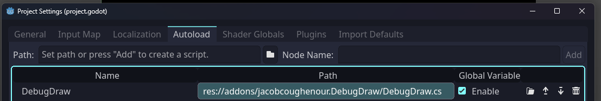

# GodotDebugDraw
This is a port of Zylann's debug_draw addon to C# and Godot 4 with some extra features.
https://github.com/Zylann/godot_debug_draw

## Usage

Put the `jacobcoughenour.DebugDraw` folder in your project's `addons` folder then
add the DebugDraw.cs as an AutoLoad script.



You can also assign a `debug_toggle` action in your input map to toggle the debug text overlay.

### Example usage

```csharp
public partial class Zombie : Node3D {

	private DebugDraw _debugDraw;

	public override void _Ready() {
		// get the debug draw singleton
		_debugDraw = DebugDraw.Get(this);
	}

	public override void _Process(double delta) {

		// draw a red wire frame cube with the center at 0,0,0 and size of 1.
		// see also: DrawBox(transform, color, [frames]) and DrawAABB(min, extent, color, [frames])
		_debugDraw.DrawBox(Vector3.Zero, Vector3.One, Colors.Red, 1);

		// draw a red line from 0,0,0 to 1,1,1.
		_debugDraw.DrawLine3D(Vector3.Zero, Vector3.One, Colors.Red, 1);

		// draw a green point at 0,0,0.
		_debugDraw.DrawPoint3D(Vector3.Zero, Colors.Green, 1);

		// draw a raycast from 0,0,0 to 0,0,-1.
		// see also: DrawRay(origin, direction, length, color, [frames])
		_debugDraw.DrawRayCast3D(Vector3.Zero, Vector3.Forward, Colors.Blue, 1);

		// draw player position to the screen in the top left.
		_debugDraw.SetText("Player Position", GlobalPosition, 1);

		// creates a metric that can be accumulated for one frame.
		_debugDraw.IncrementMetric("Number of Zombies");
	}
}

```
